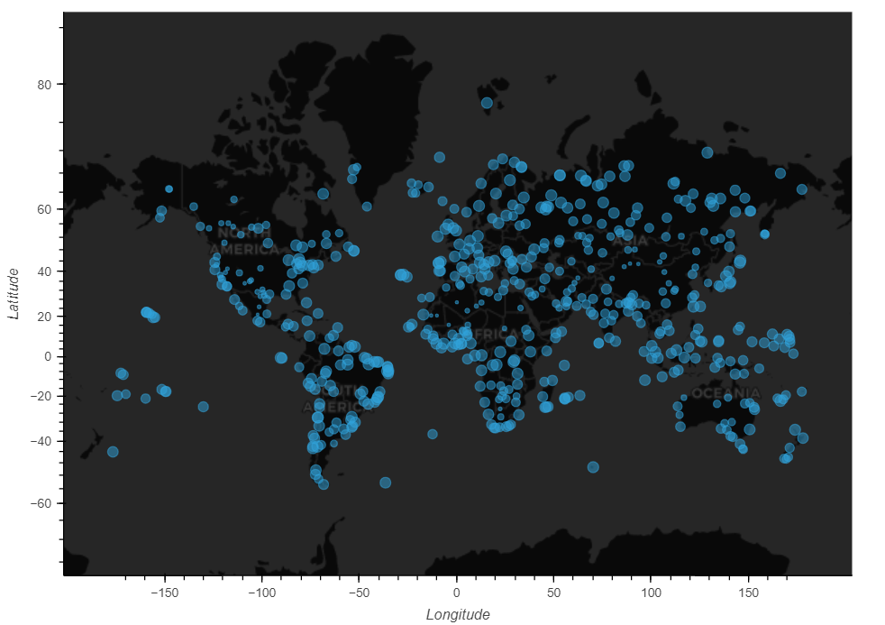

# python-api-challenge
Module 6 Challenge

Overall this challenge focuses on using APIs to collect random city locations from around the world, recording and graphing their current weather conditions, and then parsing that data based on the weather data to generate a list of hotel locations in cities that meet the defined weather conditions. The major tasks were broken into two different juypter notebook files WeatherPy, and VacationPy.

WeatherPy

The first task for WeatherPy is to generate a list of random latitude and longitude locations across the entire globe and find corresponding cities close to these randomly generated locations. Each unique city that is located is added to a blank list defined as 'cities'.

The next task uses the generated list of cities and the OpenWeather API (https://openweathermap.org/api) to collect the weather data for these cities from around the world. Using the API and I was able to pull specific information from the JSON data for each city such as latitude, longitude, maximum temperature, humdity, cloudiness, wind speed, country, and date. As the JSON data is looped through for each unique city within the 'cities' a collection of lists called 'city_data' a is populated. Then this collection of lists is converted into a Pandas dataframe named 'city_data_df'.

With the newly created dataframe I was able to generate scatter plots to show correlations between the latitude and the various weather information for each city.

The plot below is an example of the Max Temperature versus Latitude. These types of graph were also generated for humidity, cloudiness, and wind speed.

The next section focused on comparing the weather characteristics between the Northern and Southern hemispheres. These graphs also included a linear regression to attempt a best-fit line for the sample data. The example below comparing city latitude and max temperatures for the Southern hemisphere is an example of a fairly strong correlation.

This next example of city latitude compared with humidity for the Northern hemisphere is an example of a weak correlation.

 was also used  to locate the hotels in close proximity to specific cities within our data.

The first visualization plots every city from the dataframe using the latitude and longitude pulled from the OpenWeather API.

The next step filtered out most of the dataframe ‘city_data_df’ by defining ideal weather conditions by setting limits for temperature, cloudiness, and wind speed. The limits were defined as follows to generate a new dataframe named ‘nice_weather_df’.

Max Temperature > 70 F
Max Temperature < 85 F
Cloudiness < 50 %
Wind Speed < 12 MPH

Using the Geoapify API and the starter code provided I was able to generate a list of hotels within a specified 10km radius of the cities defined in ‘nice_weather_df’. Before iterating through this list with the API call a new dataframe named ‘hotel_df’ was created with a new column, “Hotel Name”, to record all of the hotels within the defined radius.

The API required parameters to be defined for the search radius, api key, latitude, longitude, and the hotel category to search by. Below is an excerpt from code with the defined parameters used for the API call.

After running the Geoapify API my ‘hotel_df’ dataframe was populated with hotel names for the nearest hotel within a 10km radius for each city name. Cities coordinates that did not have a hotel within a 10km radius simply returned “No hotel found”. Below is screenshot of the map generated with the ‘hotel_df’ dataframe. Using the ‘hover_cols’ label function that is included with ‘hvplot’ I was able to include additional column data in the hover menu that appears when interfacing with the map.

    